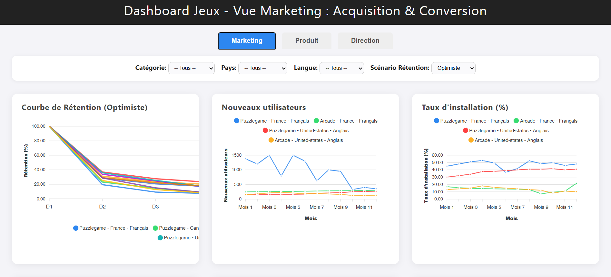

# Game Dashboard - Marketing, Product & Exec Views

A responsive web dashboard for analyzing key game metrics across marketing, product, and executive perspectives using ApexCharts.

## Features

- Three user-specific views:
  - **Marketing**: Focus on acquisition & conversion metrics
  - **Product**: Focus on engagement metrics
  - **Executive**: Focus on global business results

- Interactive charts:
  - Retention curves (optimistic/median/pessimistic scenarios)
  - Monthly trend lines for KPIs
  - Customizable color scheme

- Powerful filtering:
  - By game category
  - By country
  - By language
  - By retention scenario
